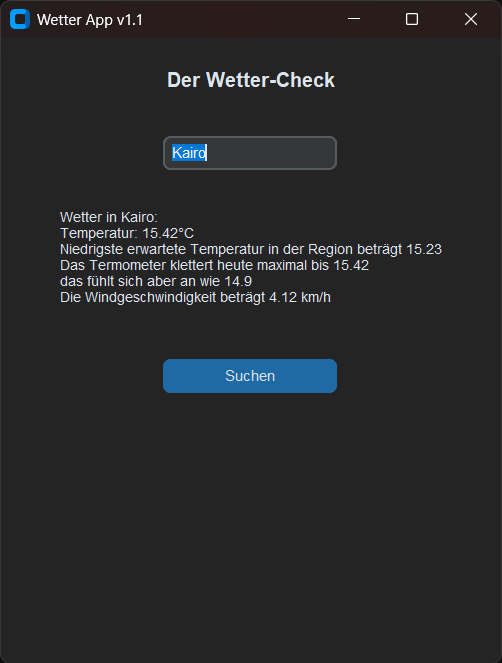

# Wetter-Check App v1.1

Dies ist eine einfache Wetter-App mit einer **überarbeiteten** grafischen Benutzeroberfläche (GUI), die ich im Rahmen meiner Python-Wochen erstellt habe.

## Funktion

Die App ermöglicht es dem Nutzer, einen Stadtnamen einzugeben und die aktuellen Wetterdaten (Temperatur, gefühlte Temperatur, Min/Max, Wind) über die OpenWeatherMap API abzurufen.
**In dieser Version wurde das Layout optimiert, um eine übersichtlichere Darstellung der Daten zu gewährleisten.**

## Screenshot

Hier ist ein Blick auf die **neue** Benutzeroberfläche:

## Struktur

Das Projekt folgt einer MVC-ähnlichen Struktur:
* `src/api/weather_client.py`: Logik für den API-Aufruf.
* `main_gui.py`: Startet die **angepasste** GUI und den Programmablauf.