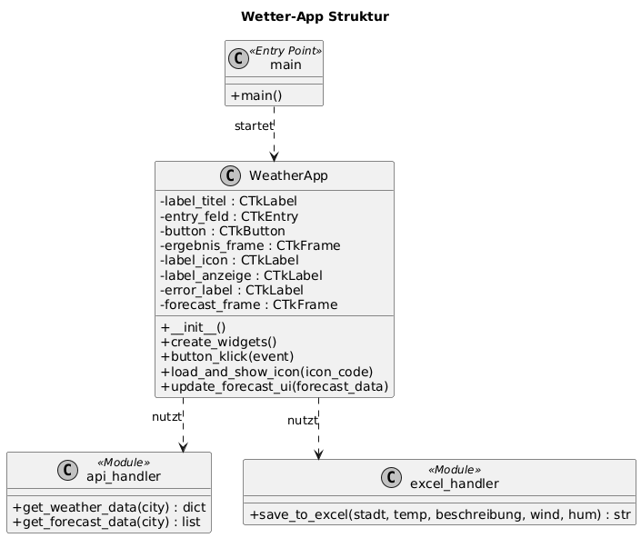
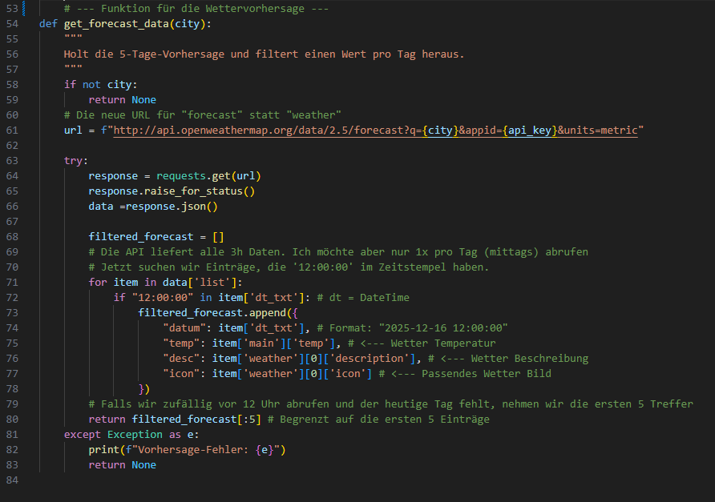
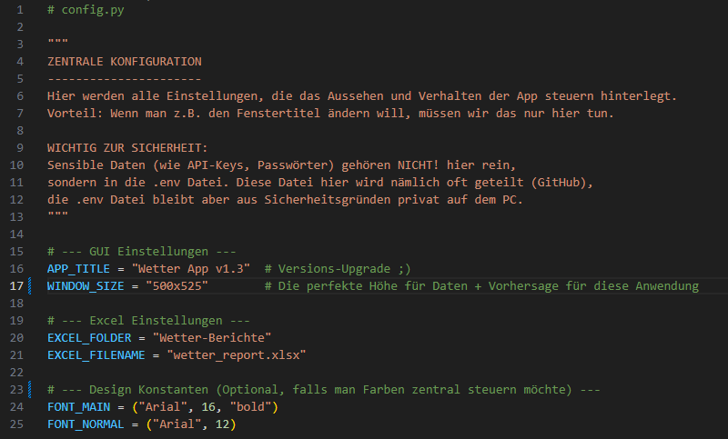

# Technische Dokumentation: Wetter App v1.3

**Projekt:** Python Desktop-Anwendung zur Wetteranalyse  
**Entwickler:** Patzenbein Lars  
**Datum:** 17.12.2025  
**Version:** 1.3

---

## 1. Einleitung und Zielsetzung

### 1.1 Projektbeschreibung
Im Rahmen der Umschulung zum Fachinformatiker für Anwendungsentwicklung (FIAE) wurde eine Desktop-Applikation entwickelt, die Wetterdaten visualisiert und persistiert. Die Anwendung dient als Schnittstelle zwischen der OpenWeatherMap API und einer lokalen Excel-Datenbank.

### 1.2 Kernfunktionen
* **Echtzeit-Abfrage:** Nutzer können beliebige Städtenamen eingeben.
* **Daten-Visualisierung:** Anzeige der aktuellen Metriken (Temperatur, Wind, Feuchtigkeit) sowie eines grafischen 5-Tage-Trends inklusive Wetter-Icons.
* **Automatisches Reporting:** Jede erfolgreiche Abfrage wird automatisch in einer Excel-Arbeitsmappe archiviert. Dabei wird für jede Stadt dynamisch ein eigenes Tabellenblatt angelegt.

---

## 2. Systemarchitektur

### 2.1 Aufbau
Die Anwendung folgt dem Prinzip der **Separation of Concerns** (Trennung der Zuständigkeiten). Die Logik für die Datenbeschaffung, die Datenspeicherung und die Anzeige ist in separaten Modulen organisiert.

*(Abbildung 1: UML-Klassendiagramm der Gesamtarchitektur)*

### 2.2 Modulübersicht
* **`main.py`:** Entry-Point. Initialisiert die Anwendung.
* **`gui.py`:** Enthält die Klasse `WeatherApp` (erbt von `ctk.CTk`). Verantwortlich für das UI-Layout und Event-Handling.
* **`api_handler.py`:** Kapselt die HTTP-Requests an die REST-API.
* **`excel_handler.py`:** Verwaltet den Schreibzugriff auf die `wetter_report.xlsx` mittels der `pandas` Bibliothek.
* **`config.py`:** Zentrale Konfigurationsdatei für Konstanten.

---

## 3. Implementierungsdetails (Code-Analyse)

Dieser Abschnitt beleuchtet zentrale Code-Strukturen, die für die Stabilität und Wartbarkeit der Anwendung entscheidend sind.

### 3.1 Die Vorhersage-Logik (`api_handler.py`)
Eine besondere Herausforderung war die Aufbereitung der 5-Tage-Vorhersage. Die API liefert Daten in 3-Stunden-Intervallen (also 8 Datensätze pro Tag). Um eine übersichtliche Vorschau zu generieren, musste ein Algorithmus implementiert werden, der gezielt die Mittagsdaten herausfiltert.

Wie im folgenden Code-Ausschnitt zu sehen ist, iteriert die Funktion durch die JSON-Liste und prüft den Zeitstempel auf "12:00:00". Zusätzlich wird die Rückgabe auf maximal 5 Einträge begrenzt (`[:5]`), um Layout-Fehler zu vermeiden.

*(Abbildung 2: Filter-Logik für die 5-Tage-Vorhersage)*

### 3.2 Wartbarkeit durch Konfiguration (`config.py`)
Um "Magic Numbers" und fest codierte Pfade im Quellcode zu vermeiden, wurden alle globalen Einstellungen zentralisiert. Dies erleichtert zukünftige Anpassungen (z.B. Änderung der Fenstergröße oder des Speicherpfads), ohne in die Logik-Dateien eingreifen zu müssen.

Wichtig hierbei ist die Trennung von **Konfiguration** (öffentlich, GitHub) und **Secrets** (privat, `.env`). API-Keys tauchen hier bewusst nicht auf.

*(Abbildung 3: Die ausgelagerte Konfigurationsdatei)*

### 3.3 Dynamische UI-Generierung
Die 5-Tage-Vorhersage wird in der `gui.py` nicht statisch angelegt, sondern dynamisch generiert. Die Methode `update_forecast_ui` löscht zunächst alte Widgets (`widget.destroy()`) und baut dann basierend auf der Länge der Datenliste neue Frames auf. Dies verhindert, dass sich alte und neue Wetterdaten grafisch überlagern.

---

## 4. Technische Herausforderungen & Lösungen

### 4.1 Bildverarbeitung (Icons)
Die Wetter-Icons werden von der OpenWeatherMap API als URL bereitgestellt. Da UI-Frameworks oft lokale Dateien erwarten, musste eine Lösung mittels `Pillow` (PIL) und `io.BytesIO` implementiert werden. Dies ermöglicht das Laden des Bildes direkt in den Arbeitsspeicher (RAM-Stream), was die Performance erhöht und unnötige Dateisystemzugriffe verhindert.

### 4.2 Excel Append-Logik
Eine Herausforderung bestand darin, neue Wetterdaten in die Excel-Datei zu schreiben, ohne bestehende Historien zu überschreiben. Die Lösung wurde durch die Nutzung von `openpyxl` als Engine für `pandas` realisiert. Die App prüft nun vor dem Schreiben, ob für die jeweilige Stadt bereits ein "Sheet" existiert, und hängt die Daten entsprechend an ("Append"-Modus).

---

## 5. Fazit und Ausblick

Die Anwendung erfüllt alle gestellten Anforderungen (GUI, API, Excel-Persistenz). Durch die modulare Struktur ist der Code gut lesbar und erweiterbar. Das Projekt demonstriert den sicheren Umgang mit externen APIs, Datentransformation (JSON zu Python Dict) und Dateisystem-Operationen.

**Mögliche Erweiterungen für v2.0:**
* Implementierung einer grafischen Auswertung der Excel-Daten (z.B. Temperaturverlauf als Kurvendiagramm mittels `matplotlib`).
* Erweiterung der API-Daten um stündliche Vorhersagen.
* Erstellung einer ausführbaren Datei (.exe) mittels PyInstaller für die Verteilung ohne Python-Installation.