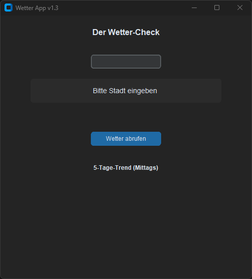
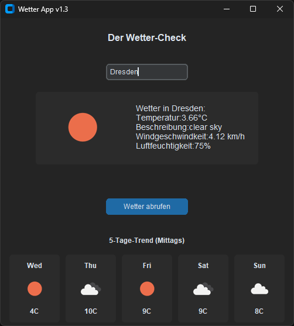

# 🌤️ Wetter App v1.3 (Python & Excel)

Ein Python-Tool, das aktuelle Wetterdaten über eine API abruft, in einer grafischen Oberfläche (GUI) anzeigt und automatisch sortiert in einen Excel-Bericht exportiert.

## Vorschau

Hier ist die App in Aktion – vom Start bis zur Vorhersage:

| Startbildschirm | Ergebnis & 5-Tage-Trend |
| :---: | :---: |
|  |  |

## Features

* **Live-Wetterdaten:** Abruf aktueller Daten (Temperatur, Beschreibung, Wind, Luftfeuchtigkeit) via API.
* **Grafische Oberfläche (GUI):** Benutzerfreundliche Eingabe im modernen Dark-Mode (CustomTkinter).
* **NEU: 5-Tage-Trend:** Grafische Vorschau für die kommenden Tage (Mittagswerte).
* **NEU: Dynamische Icons:** Lädt das passende Wetter-Symbol live von OpenWeatherMap.
* **Intelligenter Excel-Export:**
    * Erstellt automatisch eine `wetter_report.xlsx`.
    * **Dynamische Tabellenblätter:** Jede Stadt erhält automatisch ein eigenes Tabellenblatt (Sheet).
    * Historie: Neue Daten werden unten angefügt, ohne alte zu überschreiben.
    * Formatierung: Automatische Header-Formatierung (Fett & Blau).

## Architektur

Die Anwendung folgt einer klaren Trennung zwischen Oberfläche (GUI), Logik (API) und Datenhaltung (Excel).


## Projektstruktur

* `main.py`: Der Einstiegspunkt (Entry Point). Startet die Anwendung.
* `gui.py`: Erstellt das Fenster, lädt Bilder und verknüpft die Logik.
* `api_handler.py`: Holt Wetterdaten und Icons von der API.
* `excel_handler.py`: Speichert die Daten sortiert in die Excel-Datei (`Wetter-Berichte/`).
* `.env`: Speichert sensible Daten wie den API-Key (wird nicht auf GitHub hochgeladen).
* `config.py`: Zentrale Konfiguration (Fenstergröße, Titel, Pfade).
* `img/`: Ordner für Assets und Dokumentationsbilder.
* `requirements.txt`: Liste aller benötigten Python-Bibliotheken.

---

## Installation & Start

1.  **Repository klonen:**
    ```bash
    git clone [https://github.com/Exoshiva/Pythonwochen/tree/main/TestProject6](https://github.com/Exoshiva/Pythonwochen/tree/main/TestProject6)
    ```

2.  **Abhängigkeiten installieren:**
    ```bash
    pip install -r requirements.txt
    ```

3.  **API-Key hinterlegen:**
    Erstelle eine Datei `.env` im Hauptverzeichnis und füge deinen Key ein:
    ```env
    OPENWEATHER_API_KEY=dein_eigener_api_key
    ```

4.  **Programm starten:**
    ```bash
    python main.py
    ```

## Nutzung

1.  Gib einen Stadtnamen in das Suchfeld ein.
2.  Klicke auf "Wetter abrufen" (oder drücke Enter).
3.  Die Daten und der 5-Tage-Trend werden angezeigt und **automatisch** im Hintergrund in den Ordner `Wetter-Berichte` gespeichert.

## Verwendete Technologien

* Python 3.x
* **Pandas & OpenPyXL:** Für das Excel-Management.
* **CustomTkinter:** Für das moderne UI.
* **Requests:** Für den API-Abruf.
* **Pillow (PIL):** Für die Bildverarbeitung der Wetter-Icons.

---
*Erstellt als Abschlussprojekt im Python-Modul.*